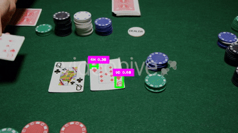

---

# 🃏 Poker Hand Detection using YOLOv8

<p align="center">
  
  
  
  
  
</p>

---

  
*Live demo showing card detection, classification, and real-time poker hand recognition.*

---

## 🎮 Project Overview

This project detects and classifies **playing cards** using a **custom-trained YOLOv8 model** and then determines the **poker hand ranking** (e.g., *Full House, Straight, Royal Flush*) in real time.

The system uses a webcam to capture cards, identifies them by their suit and rank (e.g., `AS` = Ace of Spades), and automatically evaluates the best poker hand using a **custom Python function (`PokerHandFunction`)**.

It’s a perfect example of combining **Computer Vision + Game Logic + AI** into an interactive application.

---

## ✨ Key Features

* 🃏 **Real-Time Card Detection** using YOLOv8
* ♣️ **Recognizes All 52 Cards** (Clubs, Diamonds, Hearts, Spades)
* 🧠 **Automatically Evaluates Poker Hands** (via `PokerHandFunction`)
* 💻 **Webcam & Video Input Support**
* ⚡ **Fast Inference** — optimized for both CPU & GPU
* 📊 **Displays Detected Cards and Confidence Scores** on screen
* 🧩 **Fully Modular** — easy to extend for other card games

---

## 🧰 Technologies Used

* **Python 3.10+**
* **Ultralytics YOLOv8** – Object Detection Framework
* **OpenCV (cv2)** – Video Input and Display
* **cvzone** – Drawing overlays and UI enhancements
* **Math & Custom Python Logic** – For confidence and poker hand evaluation

---

## 🧠 How It Works

1. **YOLOv8 Model** (`playingCards.pt`) detects and labels cards from webcam frames.
2. **Detected card classes** (e.g., `AS`, `10H`, `KC`) are stored dynamically.
3. Once **5 cards** are identified, the script calls

   ```python
   PokerHandFunction.findPokerHand(hand)
   ```

   to determine the **poker hand type** (e.g., Straight, Flush, etc.).
4. The result is **displayed live** on the video feed with confidence scores.

---

## 🖥️ Folder Structure

```
📂 Poker_Hand_Detector
│
├── PokerHandFunction.py          # Contains logic to evaluate poker hands
├── poker_hand_detector.py        # Main script for detection & evaluation
├── playingCards.pt               # Custom YOLOv8 model weights
├── demo.gif                      # Demo preview for README
└── README.md                     # Project documentation
```

---

## ▶️ How to Run

1. **Install Dependencies:**

   ```bash
   pip install ultralytics opencv-python cvzone
   ```

2. **Download/Place Files:**

   * `playingCards.pt` → in the same folder as your Python script
   * `PokerHandFunction.py` → ensure this file contains `findPokerHand()` function

3. **Run the Script:**

   ```bash
   python poker_hand_detector.py
   ```

4. **Show your cards in front of the webcam**, and once 5 are detected — your **poker hand** will appear on screen automatically.

---

## 🧩 Example Output

| Frame | Detected Cards                  | Evaluated Hand |
| ----- | ------------------------------- | -------------- |
| 1     | ['10H', 'JH', 'QH', 'KH', 'AH'] | Royal Flush    |
| 2     | ['2C', '2D', '2S', 'KD', 'KH']  | Full House     |
| 3     | ['5S', '6S', '7S', '8S', '9S']  | Straight Flush |

🟢 **Detected Hand Displayed On-Screen:**

> `Results: Full House`

---

## 🚀 Future Enhancements

* 🧮 Add **card localization tracking** (multi-player support)
* 🃠 Include **automatic score calculation**
* 💾 Save each detected hand result to a **CSV or database**
* 🧠 Integrate **reinforcement learning** for AI poker strategy
* 🎮 Develop a **Streamlit or Tkinter UI** for interactive play

---


## 👨‍💻 About the Developer

**Usama Munawar** – Data Scientist | MPhil Scholar | Machine Learning Enthusiast  
Passionate about transforming raw data into meaningful insights and intelligent systems.  

🌍 Connect with me:

[](https://github.com/UsamaMunawarr)[](https://www.linkedin.com/in/abu--usama)[](https://www.youtube.com/@CodeBaseStats)[](https://twitter.com/Usama__Munawar?t=Wk-zJ88ybkEhYJpWMbMheg&s=09)[](https://www.facebook.com/profile.php?id=100005320726463&mibextid=9R9pXO)

---
